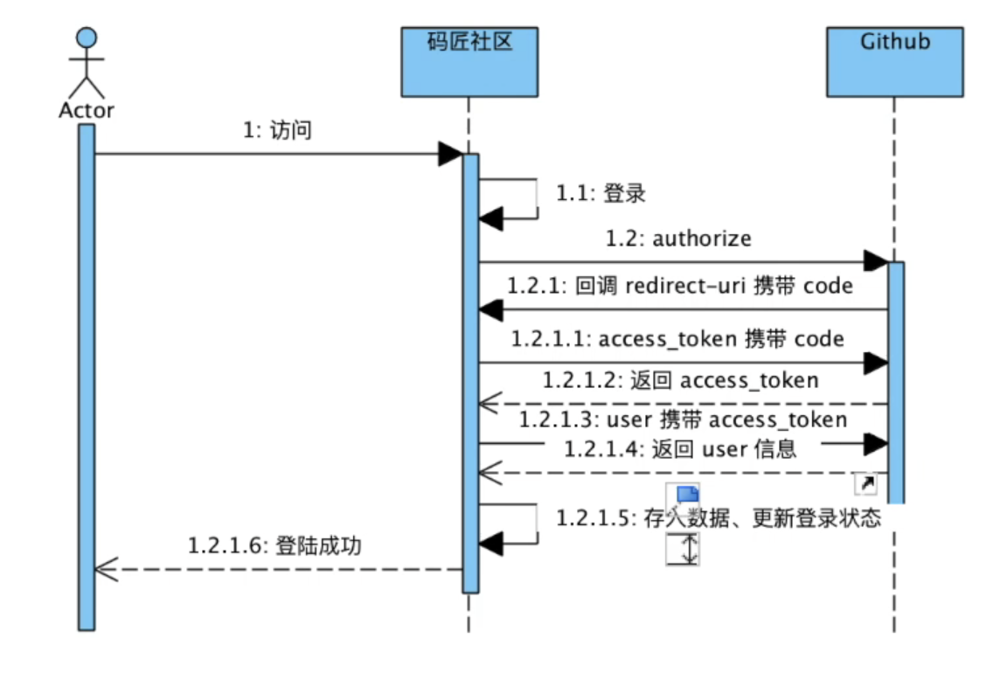
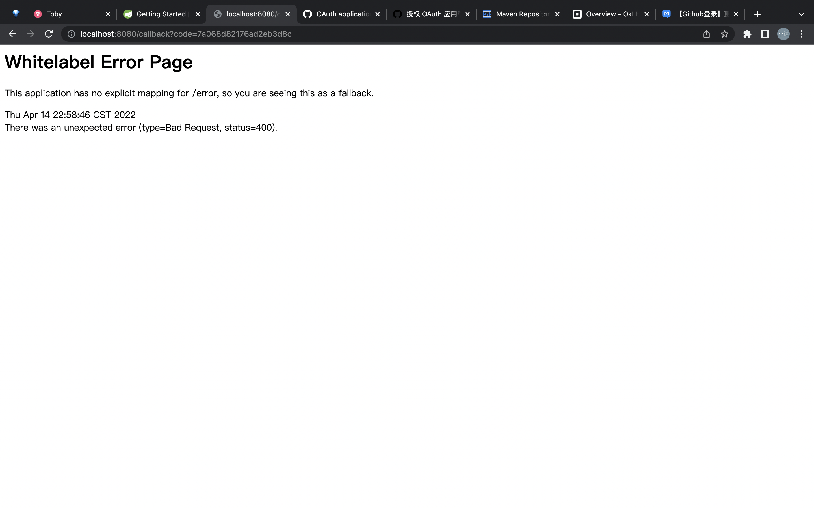

# 学习资料
[Mybatis](https://www.cnblogs.com/best/p/9711215.html)
[参考链接](https://github.com/codedrinker/community)

# 3. 需求分析
* 对标https://elasticsearch.cn

# 4.初识BootStrap
+ [bootstarp](https://v3.bootcss.com/)
+ [bootstrap栅格系统：](https://v3.bootcss.com/css/#grid)
+ [github OAuth]()

# 5.申请github APP 从github登录

* 注册github APP 文档说明
    + github页面底层API —— Github Docs Developers - APPS -Building OAuth APPS

* 注册github APP
    + Settings-develop Settings - OAuth Apps

* 图解Github登录流程
  + 点击登录按钮，调用github的authorize接口，此时github会自动跳转到callback地址，携带code回来
  + 我们获取到code之后，调用github的access_token接口获取到access_token
  + 获取的到access_token后继续调用github的user接口，即可返回user信息
  
  
* Github登录调用authorize
  * index.html <li><a href="https://github.com/login/oauth/authorize?client_id=5be78fe1bbbc06cf95de&redirect_uri=http://localhost:8080/callback&scope=user">登录</a></li>

* Github获取code
  * AuthorizeController
  * okHttp
  
* Github登录之获取用户信息
  * provider-GithubProvider.class 
  IOC:有```@Componet```注解，对象会自动实力化放入容器中
  * dto:data to object
    * AccessTokenDTO.class
  
> 此处结束后运行起来发现无法获取用户名和ID，按照如下帖子更正 
> https://www.mawen.co/question/723
> 

* 配置application.properties
springboot启动时，会以map的形式将文件中的值放入容器，通过```@Value(${github.client.id})```字段名获取相应的值
  
* Session 和cookie原理
  + 登录成功后显示登录态
  + session 相当于银行账户
    + 通过 ```HttpServletRequest```获取到session
    + 当我们把````HttpServletRequest```写入到方法时，SpringBoot会自动将上下文中的request放到中间供我们使用
    + 获取到session，之后需要在index.html中去判断是否拿到session-百度 如何使用thymeleaf 取session 
  + cookie 相当于银行银行卡
  
+ 图解MySQL并学习其基本用法
  + UML详解-麻匠社区微信公众号
    + 泛化关系
    + 实现关系
    + 聚合关系
    + 组合关系
    + 关联关系
    + 依赖关系
    + 实箭泛化虚实现，虚线依赖实关联，空菱聚合实组合，项目沟通图常见
  + MySQL
    + 自然型解释语言
    + database table record
    + CRUD
  + H2
    + 特点：
      + 非常快，开源的JDBC API
      + 可直接内置到server里边去，内存数据库
      + 可通过浏览器直接去访问
      + small footprin：about 2MB jar file，为什么选它的原因，通过jar依赖可以直接放入文件
      + 无法创建表：[https://blog.csdn.net/nruuu/article/details/123909184]
      + 
        ```SQL
            CREATE TABLE `user`(
            `id` INT AUTO_INCREMENT PRIMARY KEY,
            `account_id` VARCHAR(100),
            `name` VARCHAR(50),
            `token` CHAR(36),
            `gmt_create` BIGINT,
            `gmt_modified` BIGINT);
        ```
        
# P17.集成 Mybaits 并实现插入数据
  + http://mybatis.org/spring-boot-starter/mybatis-spring-boot-autoconfigure/
  + Spring 官方文档[https://docs.spring.io/spring-boot/docs/2.0.0.RC1/reference/htmlsingle/#boot-features-embedded-database-support]
  + 定义数据库连接池：
  ```
    spring.datasource.url=jdbc:mysql://localhost/test
    spring.datasource.username=dbuser
    spring.datasource.password=dbpass
    spring.datasource.driver-class-name=com.mysql.jdbc.Driver
  ```
  + Mybatis
    + Mybatis会自动解析state中的内容填入#{state}中
    ```java
        @Mapper
        public interface UserMapper {
        @Insert("insert into user(name,account_id,token,gmt_create,gmt_modified) values(#{name},#{account_id},#{token},#{gmt_create},#{gmt_modified})")
        void insert(User user);
        }
    ```
  + 网络与网络之间传输数据用dto，数据传递数据用model
  + SpringBoot启动项目时：Cannot load driver class: org.h2.Driver,缺乏依赖，添加Maven: com.h2database:h2:1.4.200
  
***
# P18 实现持久化登录状态获取
  + P16
  + 手动模拟cookie和session的交互方式，以实现在服务器宕机或重启时，用户都可以重新登录，并保持登录态
  + 问题：登录成功之后，如何利用java代码，往前端写一个cookie
  + 流程：
    + 登录成功后，获取到用户信息并存储之后，从数据库获得token，以token为依据来绑定前端与后端登录状态
    + 获得用户token代替原来的session，即我们主动往cookie中写一个session，并且在登录验证的时候，能将其识别处理，如果数据库中存在该session，如果存在则登录成功，不存在则未登录成功
    + 使用 HttpServletResponse response 将token写入cookie
      ```
      HttpServletResponse response
      // 此处将token存入数据库的过程已经完成写session的过程，因此仅需要将token写入cookie 即可
            response.addCookie(new Cookie("token",token));
      ```
    + 然后在indexController.java中获取到cookie中的token，与数据库中token对比
      + 注入UserMapper
      + UserMapper中构造findByToken，在数据库中查看是否存在该token，如果存在则得到user，然后利用
      ```
        request.getSession().setAttribute("githubUser",githubUser);
      ``` 
      将user放到前端里边，来确定展示登录或者是我
  
***
# P19 集成Flyway migration
  + Flyway:java数据库移植框架
  +  [Flyway官网](https://flywaydb.org/)

  + 项目流程：
    + pom.xml文件中添加flyway插件
    + 创建文件夹 ```src/main/resource/db/migration/V1__Create_user_table.sql```并填写创表语句
    + 删除原有数据库```rm ~/community·*```
    + 运行```mvn flyway migrate```创建新表
    + 创建文件```src/main/resource/db/migration/V2__Add_bio_col_to_user_table.sql```
  + 注意
    + 使用过程中，不能更改sql脚本文件，否则会抛出异常
    + 注意文件名称一定是V__XXX
    
# P20 使用BootStrap编写文章发布页

+ publish.html
+ bootstrap 栅栏系统,更改publish.html
+ 创建publishController
```java
    @Controller
    public class publishController {
    @GetMapping("/publish")
    public String publish(){
    return "publish";
    }
    }
```
+ 设计页面
  + 详见程序publish.html，在浏览器控制终端设计页面
  + resource-static-css-community.css,设计页边距与背景色

# P21 完成文章发布功能
+ 利用flyway创建数据库
+ 创建Mapper-QuestionMapper
+ 创建Question类
+ 在publishController创建doPublish方法：
    + 当为POST请求时，执行该方法，通过request获取cookie然后获取用户信息，将发布文章的相关信息存入数据库
+ 前端增加错误信息显示

+ 总结流程：
  + form表单中添加一个action，即我们请求的地址```/publish```即post方式的路由
  + 当该表单完成后，点击submit会寻找地址为```/publish```且方法为@PostMapping()的接口
  + 并且路由到该方法中，通过RequestParam将获取到的信息放入Model中回显到前端
    
# P22添加lombok支持
* 本节主要内容：做首页
+ [lombok官网](https://projectlombok.org/)
+ 本节主要功能，用lombok，@Data
  > All together now: A shortcut for @ToString, @EqualsAndHashCode, @Getter on all fields, 
  > and @Setter on all non-final fields, and @RequiredArgsConstructor!

# P23 完成首页问题列表功能
+ indexController 在页面跳转之前添加读取Question表的List，并将读取结果放入Model传输到前端
+ 问题：头像信息存放在User表中，Question表中只有creator信息与User表中id相关联，而此时Qeustion类中表示的是数据库模型，无法增加User对象
+ 解决方案：在传输层dto，增加QuestionDTO，相比与Question增加User对象
+ 问题：增加QuestionDTO后，获取到的List中存储的是QuestionDTO对象，无法通过QuestionMapper获得
+ 解决方案：引入Service层，创建QustionService，从现在需求来看该服务可以调用QuestionMapper和UserMapper，同时调用两张表，然后将两张表的内容组合起来
+ 带有驼峰的变量Mybatis无法直接赋值即如 AVATAR_URL无法转换为avatarUrl，使用````mybatis.configuration.map-underscore-to-camle-case = true```

# P24 答疑
* textarea 使用th:value不能回显，将value改为text
* fastjson可以自动将下划线标示映射到驼峰的属性
* h2数据库到底是什么 和链接异常处理
* 列表日期格式化问题


# P25 自动部署
+ [Spring Boot Developer Tool](https://docs.spring.io/spring-boot/docs/current/reference/html/using.html#using.devtools)
+ Spring Boot Developer Tool和JRebel的区别
  SpringBoot是用两个ClassLoader
  Jrebel是将修改的字节码替换掉
  
+ 使用Developer-tool报错
```java
org.springframework.boot.devtools.restart.SilentExitExceptionHandler$SilentExitException
```
  解决方案：https://blog.csdn.net/quan278905570/article/details/116804938
  
+ 自动SpringBoot Developer-Tool自动build
  + Preference-Build，Exception，Develpoy-Compiler-勾选Build Project Automatically(只有在没有运行或者debug的时候该项才起作用)
  + run和debug的时候也可以自动bulid，command + shift + alt +  ？—— registery——compiler.automake.allow.when.app.running
  

# P26 实现分页功能
+ 修改数据库 根据页面展示需求定义查询偏移量
+ 修改QuestionDTO，传入参数page，size
+ 增加PaginationDTO


# P27 完善导航栏并进行页面拆解
[Thymleaf 8 Template layout](https://www.thymeleaf.org/doc/tutorials/3.0/usingthymeleaf.html#fragments)


# P28 个人资料发布实现


# P29 拦截器

不同页面都需要写登录代码
[Interception](https://docs.spring.io/spring-framework/docs/current-SNAPSHOT/reference/html/web.html#websocket-stomp-interceptors)
* EnableWebMVC,注解会拦截css

* 具体流程
  * 新建interceptors 包

# P30 通过源码分析不能加载资源问题


# P31 完成问题详情页面
* Creat QuestionController class
* 利用QuestionService.getById(id),获取问题页面
* QuestionService.getById(id)方法中
  * 利用QuestionMapper中getById(id)获得question
  * 通过UserMapper利用question中的creator获取
  
# P32 修复用户登录问题
* 用户登录时首先去数据库查找是否存在该用户
  * 是：跟新用户登录时间、头像、name与token
  * 否：创建新用户
  
* 退出登录
  * 删除cookie和session
  
> 异常：Expected one result (or null) to be returned by selectOne(), but found: 6
* 删除数据库·```rm ~/community.*```
* 执行数据库的migration脚本```mvn flyway:migrate```

# P33 完成问题更新功能
* 点击edit时进入更新页面，对问题进行修改

# P34 通过阅读官方文档集成Mybatis Generator
* Mybatis Generator 功能，可以根据数据库的表，自动地生成Mapper并且映射好
[mybatis generator](http://mybatis.org/generator/configreference/xmlconfig.html)

* 在/main/resources目录下创建generatorConfig.xml文件
* 运行如下命令
```bash
mvn -Dmybatis.generator.overwrite=true mybatis-generator:generate
```


* 运行结束后，如何自动注入SpringBoot呢
  * 全局配置mapper，在CommunityAppliction.class中添加
    ```java
      @MapperScan(basePackages = "com.hoo.community.mapper")
    ```
  * 在pom.xml文件中配置
  ```properties
    # 模型
    mybatis.type-aliases-package=com.hoo.community.model 
    mybatis.mapper-locations=classpath:mapper/*.xml # mapper-location
  ```
  * 更改相关文件中之前的查找方法,如SessionInterceptor.class中findByToken方法可以进行如下替换
    ```java
        User user = userMapper.findByToken(token);
    ```
    
* 遇到点击主页问题无法跳转至问题详情页面
> 解决方法：questionDTO中id 为Integer类型，而实际question 表与model中都是Long类型，
> 因此在QeustionService PaginationDTO 方法中，使用BeanUtils.copyProperties(question,questionDTO);无法成功拷贝


# 35 ControllerAdvice 和 ExceptionHandler处理异常

* 1.创建error.html页面使得有错误统一跳转至该页面
* 2.新建package-Advice，新建CustomizeExceptionHandler.class，拦截所有Controller异常，而没办法拦截Server异常


* 两步走
  * 使用ControllerAdvice实现通用异常的处理
  * 使用ErrorController实现无法定义的异常，CustomizedErrorController实现ErrorController
  
# P36 实现阅读数功能
* 在QuestionController处增加累加阅读数功能,通过直接重复+1，会存在高并发问题
* 生成的QuestionMapper.xml中查找update方法是有原子性

* 自己写SQL解决上述并发问题
  ```sql
  update QUESTION
  set
  VIEW_COUNT = VIEW_COUNT + 1
  where ID = ID;
  ```
  * 执行流程
    * 创建QuestionExtMapper.xml
    * 创建QuestionExtMappper接口，实现与.xml文件中的映射
    * 在QuestionService中调用 QuestionExtMapper中的incView方法，实现阅读数自动累加

# P37 实现回复功能，初识API
* 构建Comment_table
* 在genertatorConfig中自动生成mapper
* 构建CommentDTO用于数据查询
* 创建CommentController
* 在postman发送请求
[解决Postman报错:Could not send request](https://blog.csdn.net/qq_43523725/article/details/117077214)
  
* 流程
  * 页面通过post请求将结果发送到服务器
  * 服务器通过RequestBody自动反序列化，将json格式的数据自动化反序列化为java对象
  

# P38 实现回复，异常处理
* 在CustomizeExceptionHandler增加回复时的异常处理功能
* 通过CommentService判断处理各种情况下的异常

* 构造ResultDTO用于返回前端状态码
* 构造CommentTypeEnum用于判断评论是问题还是回复
* 因为查询时除了QuestionMapper 之外还需要CommentMapper因此构造CommentService
* 在CommentService中需要判断评论是否存在，如果评论不存在则需要把结果返回CommentController，
  因此利用在CustomizeExceptionHandler将异常返回
  
* 对于评论相关异常，希望后台返回一个json文件而非一个错误信息页面，
  因此需要在CustomizeExceptionHandler中需要对该部分自定义异常进行处理，而非统一返回error页面
  而这两种异常通过Content-Type进行区分
  通过将JSON写入response将状态码与信息返回前端
  
* CommentService需要增加评论数更新功能，所以需要在QuestionExtMapper增加incCommentCount方法


# P39 实现回复，事务
* 问题
> 当前端传回评论请求时，对插入评论与更新评论数两个操作，要么同时成功要么同时失败            
> commentMapper.insert(comment);
> question.setCommentCount(1);
> questionExtMapper.incCommentCount(question);

* 通过加入Transactinoal注解，实现事务
* 底层源码阅读

# P40 实现问题回复，页面提交回复

* 重新构造question页面
* 将评论页面内容提交至后台服务器并进行刷新
  * 当页面输入东西时，希望提交一个json-post后台，但现在不是表单，我们想做异步刷新，
    当我们点击回复时，直接通过js调用api，不刷新整个页面做局部刷新，即ajax请求
    
  * 借助jquery框架实现
  [jquery](https://jquery.com/)
    详见community.js
    
# P41 实现问题回复，不刷新页面登录
* 本节实现功能：当点击回复的时候，如果发现没有登录状态，需要弹窗提示登录状态，
  并且提示跳转登录，登录成功之后继续回到当前页面，
  而且跳转前的页面内容保持不变
  
* 上述功能只局限于页面之间的控制，而与后端无关，使用新技术localstroage
  * 点击跳转页面成功后将结果存在变量 closable中
  * 当页面加载结束之后取得变量closable，看改变量是否未true，如果是true的话关闭浏览器并将参数移除
  前端通过debugger；设置断点
    

# P42 实现回复列表功能
* 前端页面设计

* QuestionController中，不仅需要将问题展示到前端，还需要Comment的列表,因此引入CommentService


# P46 问题详情页面
* 搞定发现页面右侧的相关问题
  * 第一步展示标签
  * 思路： 查询问题时，取出标签，分别根据标签去查询该标签下的列表，展示到右侧
  * 使用SQL正则表达式，然后自己在QuestionExtMapper中写正则查询语句
  
```sql
// like语句模糊匹配
select ID,TITLE,TAG from QUESTION where 
    (TAG like '%Spring Boot%'
    or TAG like '%Spring%'
    or TAG like '%Java%')
and id != 12;

// 正则表达式

select ID,TITLE,TAG from QUESTION where 
TAG regexp 'Spring Boot | Spring | Java'
and ID != 12;

```

* 希望问题倒序排
  * QuestionController——QuestionService
  

# P47 规范标签

* 服务器完成规范标签工作
* 因为tag数量比较少所以直接在java里定义实现 Cache-TagCache
* 在dto中定义TagDTO

# P49 完善回复通知功能

* 创建notification表
* 在commentService中注入NotificationMapper,因为此时确定了回复的内容，是回复评论还是回复问题
* 新建NotificationEnums，定义通知枚举类
* 在评论的时候同时创建通知，因此需要在CommentService中进行新建通知

* 构建通知页面/profile.html
* 因为在profileController中需要注入NotificationService，
  是因为传入前端的模型中需要放入问题与回复者,可以理解为model和service之间有个中间层
  
* 然后在Notification中将属性Question设置为泛型用于拓展使用

* 更改notification表，并更改相关查询业务流程

* 更改profile.html
* 为了实现点击被回复问题名称实现跳转，引入NotificationController


# P50 修复回复功能
* 为了同步导航栏与详情页面的通知数，直接通过拦截器将unreadCount放入session，然后页面从session去获取

# P51 增加富文本编辑
